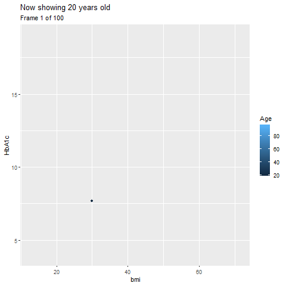

```{r setup, include=FALSE}
knitr::opts_chunk$set(echo = TRUE)
```

# Pre-amble

## Problem Statements

## Environment

```{r}
library(pacman)
p_load(readxl, Rmisc, tidyverse, summarytools, qwraps2, broom, knitr, gganimate,
       ordinal, brant, kableExtra)
options(qwraps2_markup = "markdown")
```

## Dataset & Data Wrangling

```{r, eval=F, echo=T}
dataset <- read_excel("data_ord_prac.xlsx",
                      col_types = c("numeric", "text", "text", "numeric",
                                    "numeric", "numeric", "numeric",
                                    "numeric", "skip", "skip", "skip",
                                    "skip", "skip", "skip", "numeric",
                                    "numeric", "numeric", "numeric",
                                    "numeric", "skip", "skip", "skip",
                                    "skip", "skip", "skip", "skip", "skip",
                                    "skip", "skip", "skip", "skip", "skip",
                                    "skip", "skip", "skip", "text", "text",
                                    "text", "text", "text", "text", "text",
                                    "skip", "skip", "skip", "skip", "skip",
                                    "skip", "skip", "skip", "text", "text",
                                    "text"))
write.csv(dataset,'dataset.csv')
```

### Data Exploration
```{r, warning=F}
anads0 <- read_csv("dataset.csv", col_types = cols(`Body mass index` = col_skip(),
                                                   X1 = col_skip()))
head(anads0)
```

Data Cleaning

1. remove missing value
2. remove underweight (BMI < 18.5) and very high BMI (BMI >80).
3. select only those with known dylipidaemia status (yes/no)


```{r message=FALSE, warning=FALSE}

anads1 <- anads0 %>%
    mutate(HbA1C_T = cut(HbA1c, breaks = c(0, 6.5, 7.0, 20),
                         labels = c("Target a (<= 6.5)", "Target b (6.6 - 7.0)",
                                    "Target c (>7.0)")),
           HbA1C_Ta = fct_relevel(HbA1C_T, c("Target a (<= 6.5)", "Target b (6.6 - 7.0)",
                                             "Target c (>7.0)")),
           HbA1C_Ta = ordered(HbA1C_Ta, levels = c("Target a (<= 6.5)", "Target b (6.6 - 7.0)",
                                                  "Target c (>7.0)")),
           wt = `Physical Weight`,
           gender = fct_relevel(Sex, c("Male", "Female")),
           dmage = `Diabetes Age`,
           ht = `Physical Height`,
           wc = `Physical Waist circumference`,
           tc = `Total Cholesterol`,
           ethnic = `Ethnic Group`,
           bmi = wt/((ht/100)^2)) %>% 
    filter(bmi > 18.499) %>% 
    mutate(bmic = cut(bmi, breaks = c(0, 18.499, 22.999, 26.999, 80),
                      labels = c("underweight", "normal", "overweight", "obese")),
           bmic = fct_relevel(bmic, levels = c("underweight", "normal", "overweight", "obese")),
           ethniccol = fct_collapse(ethnic, malay = "Malay", chinese = "Chinese", indian = "Indian",
                                    other = c("Bajau", "Murut", "Orang Asli (Peninsular)",
                                              "Iban", "Foreign National", "Others", "Unknown")),
           ethniccol2 = fct_relevel(ethniccol, c("malay", "chinese", "indian", "other")),
           dyslpd = fct_relevel(Dyslipidaemia, c("no", "yes"))) %>%
    select(HbA1c, HbA1C_Ta, Age, gender, ethniccol2, dmage, ht, wt, bmi, bmic, wc, 
           tc, dyslpd) %>%
    filter(dyslpd == "yes" | dyslpd == "no") %>% 
    drop_na()

str(anads1)
```

from total 9,457 samples, `r 9457 - 6055` samples with missing data, making only 6,055 sample for analysis.

# Descriptive & Exploratory Analysis

## Demographic

The mean (SD) for participants' age was `r round(mean(anads1$Age),2)` (`r round(sd(anads1$wc),2)`) years old. Participants' demographic information were summarized in tables and figures below.

```{r}
demo_sum <- list("Age (years)" =
                     list("mean (SD)" = ~ mean_sd(.data$Age, denote_sd = "paren")),
                 "Gender" = 
                     list("Male" = ~ n_perc0(.data$gender == "Male"),
                          "Female" = ~ n_perc0(.data$gender == "Female")),
                 "Ethnicity" = 
                     list("Malay" = ~ n_perc0(.data$ethniccol2 == "malay"),
                          "Chinese" = ~ n_perc0(.data$ethniccol2 == "chinese"),
                          "Indian" = ~ n_perc0(.data$ethniccol2 == "indian"),
                          "Others" = ~ n_perc0(.data$ethniccol2 == "other")),
                 "Height (cm)" =
                     list("mean (SD)" = ~ mean_sd(.data$ht, denote_sd = "paren")),
                 "Weight (cm)" =
                     list("mean (SD)" = ~ mean_sd(.data$wt, denote_sd = "paren")),
                 "BMI (kg/m^2)" =
                     list("mean (SD)" = ~ mean_sd(.data$bmi, denote_sd = "paren")),
                 "BMI Category" =
                     list("Normal (BMI  18.5 - 22.9)" = ~ n_perc0(.data$bmic == "normal"),
                          "Overweight (BMI 23 - 26.9)" = ~ n_perc0(.data$bmic =="overweight"),
                          "Obese (BMI => 27" = ~ n_perc0(.data$bmic == "obese")),
                 "Waist Circumference (cm)" =
                     list("mean (SD)" = ~ mean_sd(.data$wc, denote_sd = "paren")),
                 "HbA1c (%)" =
                     list("mean (SD)" = ~ mean_sd(.data$HbA1c, denote_sd = "paren")),
                 "Dyslipidaemia" =
                     list("Yes" = ~ n_perc0(.data$dyslpd == "yes"),
                          "No" = ~ n_perc0(.data$dyslpd == "no")))

print(summary_table(anads1, demo_sum),
      rtitle = "Demographic Summaries",
      cnames = c("Mean (SD) / n (%)"))
```


```{r, warning=F, message=F}
age_plot <- ggplot(anads1, aes(Age)) +
    geom_histogram(aes(y = ..density..), binwidth = 2, colour = "white") +
    stat_function(fun = dnorm, args = list(mean = mean(anads1$Age), sd = sd(anads1$Age))) +
    xlab("Age (years)") + ylab ("Proportion") +
    theme_minimal()

gender_chart <- ggplot(anads1, aes(gender)) +
    geom_bar() + theme_minimal()

ethnic_chart <- ggplot(anads1, aes(ethniccol2)) +
    geom_bar() + xlab("Ethnicity") +
    theme_minimal()

bmi_plot <- ggplot(anads1, aes(bmi)) +
    geom_histogram(aes(y = ..density..), binwidth = 2, colour = "white") +
    stat_function(fun = dnorm, args = list(mean = mean(anads1$bmi), sd = sd(anads1$bmi))) +
    xlim(NA, 45) +
    xlab("BMI (kg/m^2)") + ylab ("Proportion") +
    theme_minimal()

bmic_chart <- ggplot(anads1, aes(bmic)) +
    geom_bar() + xlab("BMI (category)") +
    theme_minimal()

hba1c_plot <- ggplot(anads1, aes(HbA1c)) +
    geom_histogram(aes(y = ..density..), binwidth = .5, colour = "white") +
    stat_function(fun = dnorm, args = list(mean = mean(anads1$HbA1c), sd = sd(anads1$HbA1c))) +
    xlim(NA, 15) +
    xlab("HbA1c (%)") + ylab ("Proportion") +
    theme_minimal()

ht_plot <- ggplot(anads1, aes(ht)) +
    geom_histogram(aes(y=..density..), binwidth = 5, colour = "white") +
    stat_function(fun = dnorm, args = list(mean = mean(anads1$ht), sd = sd(anads1$ht))) +
    xlim(130, 190) +
    xlab("Height (cm)") + ylab ("Proportion") +
    theme_minimal()

wt_plot <- ggplot(anads1, aes(wt)) +
    geom_histogram(aes(y=..density..), binwidth = 5, colour = "white") +
    stat_function(fun = dnorm, args = list(mean = mean(anads1$wt), sd = sd(anads1$wt))) +
    xlim(NA, 120) +
    xlab("Weight (kg)") + ylab ("Proportion") +
    theme_minimal()

wc_plot <- ggplot(anads1, aes(wc)) +
    geom_histogram(aes(y=..density..), binwidth = 5, colour = "white") +
    stat_function(fun = dnorm, args = list(mean = mean(anads1$wc), sd = sd(anads1$wc))) +
    xlim(50, 130) +
    xlab("Waist Circumference (cm)") + ylab("Proportion") +
    theme_minimal()


multiplot(age_plot, ht_plot, wt_plot, bmi_plot, wc_plot, hba1c_plot, layout = matrix(c(1,2,3,4,5,6), nrow = 3, byrow = T))
```

-**extra**-

animate plot of scatter plot between hba1c and bmi, by age

```{r, eval = F, warning=F}
animplot1 <- ggplot(anads1, aes(x = bmi, y = HbA1c)) +
    geom_point(aes(colour = Age)) +
    transition_states(Age, transition_length = 5, state_length = 3) +
    ease_aes("cubic-in-out") +
    ggtitle("Now showing {closest_state} years old",
            subtitle = "Frame {frame} of {nframes}")
animplot1out <- animate(animplot1)
magick::image_write(animplot1out, path = "myanimplot.gif" )
```




# Ordinal Logistic Regression

To determine which factors (or predictors) that associated with HbA1c target, ordinal logistic regression (cumulative logit model) will be use. The factors include BMI, waist circumference, total cholesterol level, dyslipidaemia status, gender and age.

## Univariable

Univariable analysis was done to determine association between each predictor with HbA1c target.levels(anads1$HbA1C_Ta)

```{r}
levels(anads1$HbA1C_Ta)
```

### Predictor: BMI Category

```{r}
levels(anads1$bmic)
clm_bmic <- clm(HbA1C_Ta ~ bmic, data = anads1)
kable(tidy(clm_bmic, exponentiate = T, conf.int = T), digits = 3, align = "lccccccc")
```
&nbsp;
Interpretation: 

1. As compared to low bmi, normal BMI, overweight and obese associates with higher category of HbA1c target group.
2. The odd of normal BMI being in category of target HbA1c $\leqslant$ 6.5 or above is `r round(exp(coef(clm_bmic)[3]), 2)` higher (95% CI: 1.02, 2.08, p = 0.036) than an underweight BMI.
3. The odd of overweight being in category of target HbA1c $\leqslant$ 6.5 or above is  `r round(exp(coef(clm_bmic)[4]), 2)` higher (95% CI: 1.55, 3.08, p = 0.036) than an underweight BMI. 
4. The odd of obese being in category of target HbA1c $\leqslant$ 6.5 or above is  `r round(exp(coef(clm_bmic)[5]), 2)` higher (95% CI: 1.55, 3.08, p = 0.036) than an underweight BMI. 

### Predictor: Waist Circumference

```{r}
levels(anads1$HbA1C_Ta)
clm_wc <- clm(HbA1C_Ta ~ wc, data = anads1)
kable(tidy(clm_wc, exponentiate = T, conf.int = T), digits = 3, align = "lccccccc")
```
&nbsp;
Interpretation: 

1. Higher waist circumference associates with higher category of HbA1c target group.
2. For each increase of 1 cm of waist circumference, the log odds of being in category of target HbA1c $\leqslant$ 6.5 or above was `r round(coef(clm_wc)[3], 4)`, which correspond increase of odd of `r round(exp(coef(clm_wc)[3]), 4)` times higher.
3. For each increase of 10 cm of waist circumference, the log odds of being in category of target HbA1c $\leqslant$ 6.5 or above was `r round(coef(clm_wc)[3]*10, 4)`, which correspond increase of odd of `r round(exp(coef(clm_wc)[3]*10), 3)` times higher


### Predictor: Total Cholesterol Level

```{r}
clm_tc <- clm(HbA1C_Ta ~ tc, data = anads1)
kable(tidy(clm_tc, exponentiate = T, conf.int = T), digits = 3, align = "lccccccc")
```
&nbsp;
Interpretation: 

1. Higher total cholesterol level associates with higher category of HbA1c target group.
2. For each increase of 1 mmol/L of total cholesterol level, the log odds of being in category of target HbA1c $\leqslant$ 6.5 or above was `r round(coef(clm_tc)[3], 2)`, which correspond increase of odd of `r round(exp(coef(clm_tc)[3]), 2)` times higher.
3. For each increase of 10 mmol/L of total cholesterol level, the log odds of being in category of target HbA1c $\leqslant$ 6.5 or above was `r round(coef(clm_tc)[3]*10, 2)`, which correspond increase of odd of `r round(exp(coef(clm_tc)[3]*10), 2)` times higher


### Predictor: Age

```{r}
clm_age <- clm(HbA1C_Ta ~ Age, data = anads1)
kable(tidy(clm_age, exponentiate = T, conf.int = T), digits = 3, align = "lccccccc")
```
&nbsp;
Interpretation: 

1. Higher age associates with lower category of HbA1c target group.
2. For each increase of 1 year of age, the log odds of being in category of target HbA1c $\leqslant$ 6.5 or above was `r round(coef(clm_age)[3], 2)`, which correspond to odd of `r round(exp(coef(clm_age)[3]), 2)` times.
3. For each increase of 10 year of age, the log odds of being in category of target HbA1c $\leqslant$ 6.5 or above was `r round(coef(clm_age)[3]*10, 2)`, which correspond to odd of `r round(exp(coef(clm_age)[3]*10), 2)` times.


### Predictor: Gender

```{r}
levels(anads1$gender)
clm_gender <- clm(HbA1C_Ta ~ gender, data = anads1)
kable(tidy(clm_gender, exponentiate = T, conf.int = T), digits = 3, align = "lccccccc")
```
&nbsp;
Interpretation: 

1. Gender had no association with higher category of HbA1c target group.

### Predictor: Dyslipidaemia Status

```{r}
levels(anads1$dyslpd)
clm_dyslipid <- clm(HbA1C_Ta ~ dyslpd, data = anads1)
kable(tidy(clm_dyslipid, exponentiate = T, conf.int = T), digits = 3, align = "lccccccc")
```
&nbsp;
Interpretation:

1. Dyslipidaemia status had no association with higher category of HbA1c target group.


## Multivariable

Model 1 - IV - bmicategory, waist circumference, total cholesterol, dyslipidaemia status, gender and age

```{r}
clm_mod1 <- clm(HbA1C_Ta ~ bmic + wc + tc + dyslpd + gender + Age, data = anads1)
summary(clm_mod1)
```

Model 2 - remove wc

```{r}
clm_mod2 <- clm(HbA1C_Ta ~ bmic + tc + dyslpd + gender + Age, data = anads1)
summary(clm_mod2)
```

model 3 - remove wc & bmicat

```{r}
clm_mod3 <- clm(HbA1C_Ta ~ tc + dyslpd + gender + Age, data = anads1)
summary(clm_mod3)
```


### Model comparison

done using LR test

```{r}
anova(clm_mod1, clm_mod2, test="Chisq")
anova(clm_mod2, clm_mod3, test="Chisq")
```

Interpretation: waist circumference can be remove but BMI category was an important predictor.

### Interaction

add interaction term between gender and bmi

```{r}
anads1 %>% group_by(gender) %>% descr()
t.test(anads1$tc ~ anads1$gender)
ctable(anads1$bmic, anads1$gender)
chisq.test(anads1$bmic, anads1$gender)
```

```{r}
clm_mod2ia <- clm(HbA1C_Ta ~ bmic + tc + dyslpd + gender + Age + gender:tc, data = anads1)
clm_mod2ib <- clm(HbA1C_Ta ~ bmic + tc + dyslpd + gender + Age + gender:bmic, data = anads1)

summary(clm_mod2ia)
anova(clm_mod2, clm_mod2ib)

summary(clm_mod2ib)
anova(clm_mod2, clm_mod2ib)
```

Interpretation: interaction terms was not significant

### Assumption checking - Proportional odds assumption

### Final Model

```{r}
summary(clm_mod2)
tidy(clm_mod2, conf.int = T)
tidy(clm_mod2, exponentiate = T, conf.int = T)

result_clmmod2 <- matrix(c("Variables", "", "Coefficient", "SE", "p-value", "OR (95% CI)",
                           "Intercept 1", "","","","",""),ncol=6,byrow=TRUE)
result_clmmod2

```


