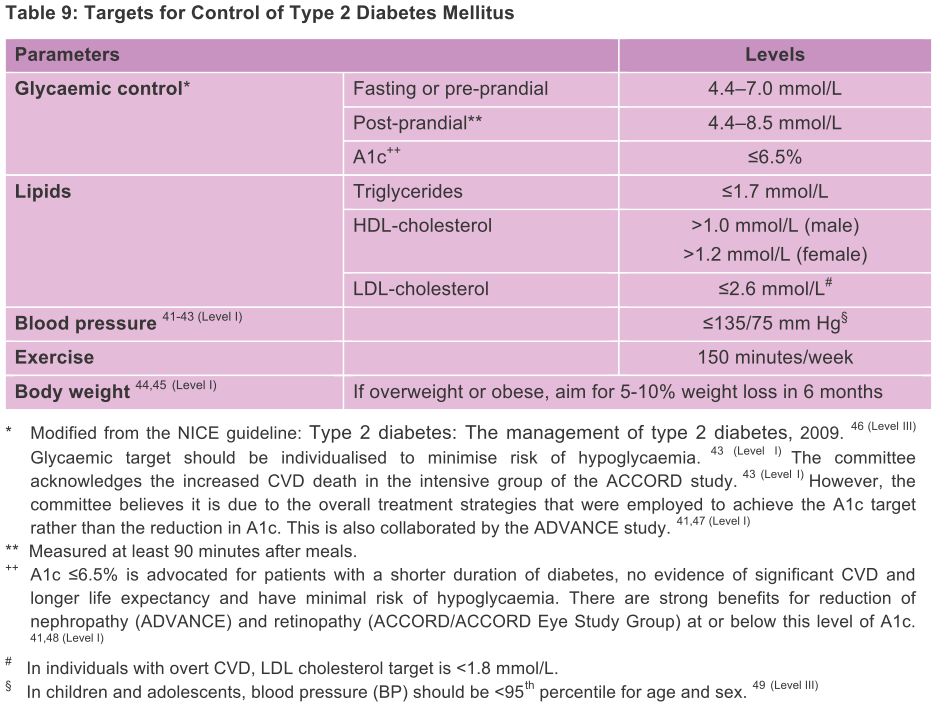
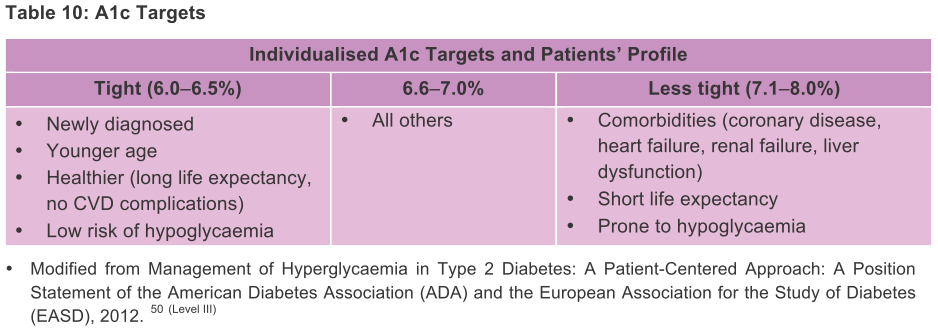

```{r setup, include=FALSE}
knitr::opts_chunk$set(echo = TRUE)
```

# Pre-amble

the code was hidden, click on the <button>code</button> button to view r-code chunk

## Problem Statements

### Introduction

Type 2 Diabetes Mellitus (T2DM) is a common non-communicable diseases in Malaysia and worlwide. NHMS 2015 estimated that 17.5% of adults in Malays have diabetes, with more than half of them were newly diagnosed. It is manifested by a chronic hyperglycaemic state in conjuction with other metabolic derangement. T2DM is an important risk factor for cardiovascular diseases and result in various microvascular and macrovascular complications. Currently there is no known cure but the disease can be controlled, enabling the individual to have an improved quality of life.

Malaysian's Clinical Practice Guidelines - Management of Type 2 Diabetes Mellitus, 5th Edition (2015) outline the main aim of management for T2DM is to reduce acute and chronic complications. In general, all patients with diabetes should undergo lifestyle modification, which consist of dietary therapy and increased physical activity. The need of medication depends on the symptoms, glycaemic control and presence of any complication.

There are several targets for control of T2DM, which consist of glycaemic control, lipid, blood pressure, exercise and body weight targets, which shown below. 


For glycaemic control, HbA1c have been used as one of the indicators. HbA1c was a good indicator for long-term glucose level, as it is a glycalated haemoglobin, as compared to capilarry glucose (which is good for acute glucose level). Generally, the target for HbA1c was 6.5% or below, however, there was also individulised HbA1c targets according to patients profile, as shown below.


### Dataset and Objective

This dataset was taken from National Diabetic Registry (NDR), which consist of diabetic patients from Perak. One of the aims of NDR as disease surveillance and clinical practice audit. Patient's demographic data and clinical information were recorded in the NDR.

For this exercise, I would like to determine, whether the HbA1c achieved by the patient will fit the patient in which group of the HbA1c target, and what are factors that may associated to the target level.


## Environment

click at code button tu reveal the r code chunk.

```{r}
library(pacman)
p_load(readxl, Rmisc, tidyverse, summarytools, qwraps2, broom, knitr, gganimate,
       ordinal, brant, kableExtra, VGAM, generalhoslem, LogisticDx)
options(qwraps2_markup = "markdown")
```

## Dataset & Data Wrangling

Import dataset from file

```{r, eval=F, echo=T}
dataset <- read_excel("data_ord_prac.xlsx",
                      col_types = c("numeric", "text", "text", "numeric",
                                    "numeric", "numeric", "numeric",
                                    "numeric", "skip", "skip", "skip",
                                    "skip", "skip", "skip", "numeric",
                                    "numeric", "numeric", "numeric",
                                    "numeric", "skip", "skip", "skip",
                                    "skip", "skip", "skip", "skip", "skip",
                                    "skip", "skip", "skip", "skip", "skip",
                                    "skip", "skip", "skip", "text", "text",
                                    "text", "text", "text", "text", "text",
                                    "skip", "skip", "skip", "skip", "skip",
                                    "skip", "skip", "skip", "text", "text",
                                    "text"))
write.csv(dataset,'dataset.csv')
```

### Data Exploration

Overview of the dataset

```{r, warning=F}
anads0 <- read_csv("dataset.csv", col_types = cols(`Body mass index` = col_skip(),
                                                   X1 = col_skip()))
head(anads0)
```

Data Cleaning

1. remove missing value
2. remove underweight (BMI < 18.5) and very high BMI (BMI >80).
3. select only those with known dylipidaemia status (yes/no)
4. convert HbA1c into the 3 HbA1c target levels
  + Target A (HbA1c < 6.6 mmol/l)
  + Target B (HbA1c 6.6 - 7.0 mmol/L)
  + Target C (HbA1c > 7.0 mmol/L)


```{r message=FALSE, warning=FALSE}

anads1 <- anads0 %>%
    mutate(HbA1C_T = cut(HbA1c, breaks = c(0, 6.5, 7.0, 20),
                         labels = c("Target a (< 6.6)", "Target b (6.6 - 7.0)",
                                    "Target c (> 7.0)")),
           HbA1C_Ta = fct_relevel(HbA1C_T, c("Target a (< 6.6)", "Target b (6.6 - 7.0)",
                                             "Target c (> 7.0)")),
           HbA1C_Ta = ordered(HbA1C_Ta, levels = c("Target a (< 6.6)", "Target b (6.6 - 7.0)",
                                                  "Target c (> 7.0)")),
           wt = `Physical Weight`,
           gender = fct_relevel(Sex, c("Female", "Male")),
           dmage = `Diabetes Age`,
           ht = `Physical Height`,
           wc = `Physical Waist circumference`,
           tc = `Total Cholesterol`,
           ethnic = `Ethnic Group`,
           bmi = wt/((ht/100)^2)) %>% 
    filter(bmi > 18.499) %>% 
    mutate(bmic = cut(bmi, breaks = c(0, 18.499, 22.999, 26.999, 80),
                      labels = c("underweight", "normal", "overweight", "obese")),
           bmic = fct_relevel(bmic, levels = c("underweight", "normal", "overweight", "obese")),
           ethniccol = fct_collapse(ethnic, malay = "Malay", chinese = "Chinese", indian = "Indian",
                                    other = c("Bajau", "Murut", "Orang Asli (Peninsular)",
                                              "Iban", "Foreign National", "Others", "Unknown")),
           ethniccol2 = fct_relevel(ethniccol, c("malay", "chinese", "indian", "other")),
           dyslpd = fct_relevel(Dyslipidaemia, c("no", "yes"))) %>%
    dplyr::select(HbA1c, HbA1C_Ta, Age, gender, ethniccol2, dmage, ht, wt, bmi, bmic, wc, 
           tc, dyslpd) %>%
    filter(dyslpd == "yes" | dyslpd == "no") %>% 
    drop_na()

str(anads1)
```

from total 9,457 samples, `r 9457 - 6055` samples with missing data, making only 6,055 sample for analysis.


# Descriptive & Exploratory Analysis

## Demographic

The mean (SD) for participants' age was `r round(mean(anads1$Age),2)` (`r round(sd(anads1$wc),2)`) years old. Participants' demographic information were summarized in tables and figures below.

```{r}
demo_sum <- list("Age (years)" =
                     list("mean (SD)" = ~ mean_sd(.data$Age, denote_sd = "paren")),
                 "Gender" = 
                     list("Male" = ~ n_perc0(.data$gender == "Male"),
                          "Female" = ~ n_perc0(.data$gender == "Female")),
                 "Ethnicity" = 
                     list("Malay" = ~ n_perc0(.data$ethniccol2 == "malay"),
                          "Chinese" = ~ n_perc0(.data$ethniccol2 == "chinese"),
                          "Indian" = ~ n_perc0(.data$ethniccol2 == "indian"),
                          "Others" = ~ n_perc0(.data$ethniccol2 == "other")),
                 "Height (cm)" =
                     list("mean (SD)" = ~ mean_sd(.data$ht, denote_sd = "paren")),
                 "Weight (cm)" =
                     list("mean (SD)" = ~ mean_sd(.data$wt, denote_sd = "paren")),
                 "BMI (kg/m^2)" =
                     list("mean (SD)" = ~ mean_sd(.data$bmi, denote_sd = "paren")),
                 "BMI Category" =
                     list("Normal (BMI  18.5 - 22.9)" = ~ n_perc0(.data$bmic == "normal"),
                          "Overweight (BMI 23 - 26.9)" = ~ n_perc0(.data$bmic =="overweight"),
                          "Obese (BMI => 27" = ~ n_perc0(.data$bmic == "obese")),
                 "Waist Circumference (cm)" =
                     list("mean (SD)" = ~ mean_sd(.data$wc, denote_sd = "paren")),
                 "HbA1c (%)" =
                     list("mean (SD)" = ~ mean_sd(.data$HbA1c, denote_sd = "paren")),
                 "HbA1c (Category)" =
                     list("Target A (< 6.6)" = ~ n_perc0(.data$HbA1C_Ta == "Target a (< 6.6)"),
                          "Target B (6.6 - 7.0)" = ~ n_perc0(.data$HbA1C_Ta == "Target b (6.6 - 7.0)"),
                          "Target C (> 7.0)" = ~ n_perc0(.data$HbA1C_Ta == "Target c (> 7.0)")),
                 "Dyslipidaemia" =
                     list("Yes" = ~ n_perc0(.data$dyslpd == "yes"),
                          "No" = ~ n_perc0(.data$dyslpd == "no")))

print(summary_table(anads1, demo_sum), rtitle = "Demographic Summaries", cnames = c("Mean (SD) / n (%)"))
```


```{r, warning=F, message=F}
age_plot <- ggplot(anads1, aes(Age)) +
    geom_histogram(aes(y = ..density..), binwidth = 2, colour = "white") +
    stat_function(fun = dnorm, args = list(mean = mean(anads1$Age), sd = sd(anads1$Age))) +
    xlab("Age (years)") + ylab ("Proportion") +
    theme_minimal()

gender_chart <- ggplot(anads1, aes(gender)) +
    geom_bar() + theme_minimal()

ethnic_chart <- ggplot(anads1, aes(ethniccol2)) +
    geom_bar() + xlab("Ethnicity") +
    theme_minimal()

bmi_plot <- ggplot(anads1, aes(bmi)) +
    geom_histogram(aes(y = ..density..), binwidth = 2, colour = "white") +
    stat_function(fun = dnorm, args = list(mean = mean(anads1$bmi), sd = sd(anads1$bmi))) +
    xlim(NA, 45) +
    xlab("BMI (kg/m^2)") + ylab ("Proportion") +
    theme_minimal()

bmic_chart <- ggplot(anads1, aes(bmic)) +
    geom_bar() + xlab("BMI (category)") +
    theme_minimal()

hba1c_plot <- ggplot(anads1, aes(HbA1c)) +
    geom_histogram(aes(y = ..density..), binwidth = .5, colour = "white") +
    stat_function(fun = dnorm, args = list(mean = mean(anads1$HbA1c), sd = sd(anads1$HbA1c))) +
    xlim(NA, 15) +
    xlab("HbA1c (%)") + ylab ("Proportion") +
    theme_minimal()

HbA1CTa_chart <- ggplot(anads1, aes(HbA1C_Ta)) +
    geom_bar() + xlab("Type of Hba1c Target") +
    theme_minimal()

ht_plot <- ggplot(anads1, aes(ht)) +
    geom_histogram(aes(y=..density..), binwidth = 5, colour = "white") +
    stat_function(fun = dnorm, args = list(mean = mean(anads1$ht), sd = sd(anads1$ht))) +
    xlim(130, 190) +
    xlab("Height (cm)") + ylab ("Proportion") +
    theme_minimal()

wt_plot <- ggplot(anads1, aes(wt)) +
    geom_histogram(aes(y=..density..), binwidth = 5, colour = "white") +
    stat_function(fun = dnorm, args = list(mean = mean(anads1$wt), sd = sd(anads1$wt))) +
    xlim(NA, 120) +
    xlab("Weight (kg)") + ylab ("Proportion") +
    theme_minimal()

wc_plot <- ggplot(anads1, aes(wc)) +
    geom_histogram(aes(y=..density..), binwidth = 5, colour = "white") +
    stat_function(fun = dnorm, args = list(mean = mean(anads1$wc), sd = sd(anads1$wc))) +
    xlim(50, 130) +
    xlab("Waist Circumference (cm)") + ylab("Proportion") +
    theme_minimal()

dyslpd_chart <- ggplot(anads1, aes(dyslpd)) +
  geom_bar() + theme_minimal()

multiplot(age_plot, gender_chart, ethnic_chart, ht_plot, layout = matrix(c(1,2,3,4), ncol = 2, byrow = T))
multiplot(wt_plot, bmi_plot, bmic_chart, wc_plot, layout = matrix(c(1,2,3,4), ncol = 2, byrow = T))
multiplot(hba1c_plot, HbA1CTa_chart, dyslpd_chart, layout = matrix(c(1,2,3,4), ncol = 2, byrow = T))
```

-**extra**-

animate plot of scatter plot between hba1c and bmi, by age

```{r, eval = F, warning=F}
animplot1 <- ggplot(anads1, aes(x = bmi, y = HbA1c)) +
    geom_point(aes(colour = Age)) +
    transition_states(Age, transition_length = 5, state_length = 3) +
    ease_aes("cubic-in-out") +
    ggtitle("Now showing {closest_state} years old",
            subtitle = "Frame {frame} of {nframes}")
animplot1out <- animate(animplot1)
magick::image_write(animplot1out, path = "myanimplot.gif" )
```


# Ordinal Logistic Regression

To determine which factors (or predictors) that associated with HbA1c target, ordinal logistic regression (cumulative logit model) will be use. The factors include BMI, waist circumference, total cholesterol level, dyslipidaemia status, gender and age.

## Univariable Analysis {.tabset .tabset-fade .tabset-pills}

Univariable analysis was done to determine association between each predictor with HbA1c target.

```{r}
levels(anads1$HbA1C_Ta)
```

Please click at the tab below to view for univariable analysis for each predictor.  

### BMI

Predictor: BMI Category

Simple chart between BMI category and HbA1c Target Level
```{r}
levels(anads1$bmic)
ggplot(anads1, aes(HbA1C_Ta, fill=bmic)) +
  geom_bar(position = position_dodge()) +
  xlab("HbA1c Target Group") + theme_minimal()
```
&nbsp;  
Univariable Analysis Result

```{r}
clm_bmic <- clm(HbA1C_Ta ~ bmic, data = anads1)
kable(tidy(clm_bmic, exponentiate = T, conf.int = T), digits = 3, align = "lccccccc")
```
&nbsp;  
Interpretation: 

1. BMI category had association with higher category of HbA1c target group.
2. The odd of overweight BMI being in category of target HbA1c $\leqslant$ 6.5 or above is `r round(exp(coef(clm_bmic)[3]), 2)` higher (95% CI: 1.10, 1.46, p = 0.001) than a normal BMI.
3. The odd of obese being in category of target HbA1c $\leqslant$ 6.5 or above is  `r round(exp(coef(clm_bmic)[4]), 2)` higher (95% CI: 1.30, 1.71, p < 0.001) than a normal BMI. 

### WC

Predictor: Waist Circumference

Simple chart between waist circumference and HbA1c Target level

```{r, warning=F}
ggplot(anads1, aes(wc)) +
  geom_histogram() + facet_wrap(.~ HbA1C_Ta) +
  theme_minimal()
anads1 %>% group_by(HbA1C_Ta) %>% 
  summarise(mean = mean(wc), sd = sd(wc)) %>%
  kable(digits = 2, align = "lcc")
```
&nbsp;  
Univariable Analysis Result

```{r}
clm_wc <- clm(HbA1C_Ta ~ wc, data = anads1)
kable(tidy(clm_wc, exponentiate = T, conf.int = T), digits = 3, align = "lccccccc")
```
&nbsp;  
Interpretation: 

1. Higher waist circumference associates with higher category of HbA1c target group.
2. For each increase of 1 cm of waist circumference, the log odds of being in category of target HbA1c $\leqslant$ 6.5 or above was `r round(coef(clm_wc)[3], 4)`, which correspond increase of odd of `r round(exp(coef(clm_wc)[3]), 4)` times higher.
3. For each increase of 10 cm of waist circumference, the log odds of being in category of target HbA1c $\leqslant$ 6.5 or above was `r round(coef(clm_wc)[3]*10, 4)`, which correspond increase of odd of `r round(exp(coef(clm_wc)[3]*10), 3)` times higher


### TC

Predictor: Total Cholesterol Level

Simple chart between total cholesterol level and HbA1c target level

```{r, warning=F}
ggplot(anads1, aes(tc)) +
  geom_histogram() + facet_wrap(.~ HbA1C_Ta) +
  theme_minimal()
anads1 %>% group_by(HbA1C_Ta) %>% 
  summarise(mean = mean(tc), sd = sd(tc)) %>%
  kable(digits = 2, align = "lcc")
```

&nbsp;  
Univariable Analysis Result

```{r}
clm_tc <- clm(HbA1C_Ta ~ tc, data = anads1)
kable(tidy(clm_tc, exponentiate = T, conf.int = T), digits = 3, align = "lccccccc")
```
&nbsp;  
Interpretation: 

1. Higher total cholesterol level associates with higher category of HbA1c target group.
2. For each increase of 1 mmol/L of total cholesterol level, the log odds of being in category of target HbA1c $\leqslant$ 6.5 or above was `r round(coef(clm_tc)[3], 2)`, which correspond increase of odd of `r round(exp(coef(clm_tc)[3]), 2)` times higher.
3. For each increase of 10 mmol/L of total cholesterol level, the log odds of being in category of target HbA1c $\leqslant$ 6.5 or above was `r round(coef(clm_tc)[3]*10, 2)`, which correspond increase of odd of `r round(exp(coef(clm_tc)[3]*10), 2)` times higher


### Age

Predictor: Age

Simple chart between age and HbA1c target level

```{r, warning=F}
ggplot(anads1, aes(Age)) +
  geom_histogram() + facet_wrap(.~ HbA1C_Ta) +
  theme_minimal()
anads1 %>% group_by(HbA1C_Ta) %>% 
  summarise(mean = mean(Age), sd = sd(Age)) %>%
  kable(digits = 2, align = "lcc")
```

&nbsp;  
Univariable Analysis Result

```{r}
clm_age <- clm(HbA1C_Ta ~ Age, data = anads1)
kable(tidy(clm_age, exponentiate = T, conf.int = T), digits = 3, align = "lccccccc")
```
&nbsp;  
Interpretation: 

1. Higher age associates with lower category of HbA1c target group.
2. For each increase of 1 year of age, the log odds of being in category of target HbA1c $\leqslant$ 6.5 or above was `r round(coef(clm_age)[3], 2)`, which correspond to odd of `r round(exp(coef(clm_age)[3]), 2)` times.
3. For each increase of 10 year of age, the log odds of being in category of target HbA1c $\leqslant$ 6.5 or above was `r round(coef(clm_age)[3]*10, 2)`, which correspond to odd of `r round(exp(coef(clm_age)[3]*10), 2)` times.


### Gender

Predictor: Gender

simple chart between gender and HbA1c target level

```{r}
levels(anads1$gender)
ggplot(anads1, aes(HbA1C_Ta, fill=gender)) +
  geom_bar(position = position_dodge()) +
  xlab("HbA1c Target Group") + theme_minimal()
```
&nbsp;  
Univariable Analysis Result


```{r}
clm_gender <- clm(HbA1C_Ta ~ gender, data = anads1)
kable(tidy(clm_gender, exponentiate = T, conf.int = T), digits = 3, align = "lccccccc")
```
&nbsp;  
Interpretation: 

1. Gender had no association with higher category of HbA1c target group.

### Dyslipidaemia

Predictor: Dyslipidaemia Status

simple chart between dyslipidaemia status and HbA1c target level

```{r}
levels(anads1$dyslpd)
ggplot(anads1, aes(HbA1C_Ta, fill=dyslpd)) +
  geom_bar(position = position_dodge()) +
  xlab("HbA1c Target Group") + theme_minimal()
```
&nbsp;  
Interpretation: 


```{r}
clm_dyslipid <- clm(HbA1C_Ta ~ dyslpd, data = anads1)
kable(tidy(clm_dyslipid, exponentiate = T, conf.int = T), digits = 3, align = "lccccccc")
```
&nbsp;
Interpretation:

1. Dyslipidaemia status had no association with higher category of HbA1c target group.


## Multivariable Analysis

For multivariable analysis, several independent variables were identified and included in the preliminary main effect models.

### Preliminary Main Effect Models

#### Model 1

For preliminary main effect model 1, independent variables that included were **BMI category**, **waist circumference**, **total cholesterol level**, **dyslipidaemia status**, **gender** and **age**.

```{r}
clm_mod1 <- clm(HbA1C_Ta ~ bmic + wc + tc + dyslpd + gender + Age, data = anads1)
kable(tidy(clm_mod1, exponentiate = T, conf.int = T), digits = 3, align = "lcccc")
```

#### Model 2

For preliminary main effect model 2, predictor **waist circumference** was removed

```{r}
clm_mod2 <- clm(HbA1C_Ta ~ bmic + tc + dyslpd + gender + Age, data = anads1)
kable(tidy(clm_mod2, exponentiate = T, conf.int = T), digits = 3, align = "lcccc")
```

#### Model 3

For preliminary main effect model 3, predictor **waist circumference** and **BMI Category** was removed

```{r}
clm_mod3 <- clm(HbA1C_Ta ~ tc + dyslpd + gender + Age, data = anads1)
kable(tidy(clm_mod3, exponentiate = T, conf.int = T), digits = 3, align = "lcccc")
```

### Model comparison

All three preliminary models were compared using LR test

```{r, warning=F}
anova(clm_mod1, clm_mod2)
anova(clm_mod2, clm_mod3)
```

Interpretation: waist circumference can be remove but BMI category was an important predictor.

### Interaction

There are two interaction that possibly may affect the model, which include

1. gender and total cholesterol level
2. gender and BMI category

#### Interaction between gender and total cholesterol level

Gender and total cholesterol level may have interaction because it was found that male had higher total cholesterol level as compared to female [t-test (df) = 9.45 (5,179.9), p < 0.001]

```{r}
t.test(anads1$tc ~ anads1$gender)
clm_mod2ia <- clm(HbA1C_Ta ~ bmic + tc + dyslpd + gender + Age + gender:tc, data = anads1)
anova(clm_mod2, clm_mod2ia)
```

Interpretation: interaction between gender and total cholesterol level was not significant.

#### Interaction beween gender and BMI category

Gender and BMI category may have interaction because it was significant different [$\chi^2$(df) = 20.67 (2), p < 0.001]

```{r}
ctable(anads1$bmic, anads1$gender)
chisq.test(anads1$bmic, anads1$gender)
clm_mod2ib <- clm(HbA1C_Ta ~ bmic + tc + dyslpd + gender + Age + gender:bmic, data = anads1)
anova(clm_mod2, clm_mod2ib)
```

Interpretation: interaction between gender and BMI category was not significant

### Assumption checking - Proportional odds assumption

One of assumption in ordinal logistic regression, which is proportional odds assumption was checked for numerical variables, which includes

1. total cholesterol level
2. age

```{r}
nominal_test(clm_mod2)
```

Interpretation: 

1. Proportional odds assumption for total cholesterol level variable was violated.
2. Proportional odds assumption for age variable was violated

Since assumption for proportionality was violated, cholesterol level and age was categorized.

```{r}
anads2 <- anads1 %>% 
  mutate(tcc = cut(tc, breaks = c(0, 5.2, 6.2, 14),
                   labels = c("good", "borderline", "uncontrolled")),
         agec = cut(Age, breaks = c(0,18,50,60,70,100),
                    labels = c("< 18 yo", "19 - 50 yo", "51 - 60 yo", "61 - 70 yo", "above 70 yo")))
freq(anads2$agec)
freq(anads2$tcc)
```

#### Revised Model

total cholesterol level and age variables was changed to total cholesterol category and age category variable

```{r}
clm_mod2R <- clm(HbA1C_Ta ~ bmic + tcc + dyslpd + gender + agec, data = anads2)
kable(tidy(clm_mod2R, exponentiate = T, conf.int = T), digits = 3, align = "lcccc")
```
&nbsp;  
Proportional odds assumption was not tested due to none of the independent variables was numerical data.

# Final Model

In final models, it was found that variables BMI category, total cholesterol level category, dyslipidaemia status, gender and age category were significantly associated with HbA1c target level. Ordinal logistic regression was summarised in table below.

```{r}
result_clmmod2 <- matrix(c("Intercept 1 (A|B)*", round(coef(clm_mod2R)[1], 3), 0.109,"<0.001","", "", "",
                           "Intercept 2 (B|C)*", round(coef(clm_mod2R)[2], 3), 0.109, 0.007, "", "", "",
                           "Normal", 0, "", "", 1, "", "",
                           "Overweight", round(coef(clm_mod2R)[3], 3), 0.074, 0.048, round(exp(coef(clm_mod2R)[3]), 3), round(exp(confint(clm_mod2R)[1, 1:2]), 3),
                           "Obese", round(coef(clm_mod2R)[4], 3), 0.072, 0.001, round(exp(coef(clm_mod2R)[4]), 3), round(exp(confint(clm_mod2R)[2, 1:2]), 3),
                           "Good", 0, "", "", 1, "", "",
                           "Borderline", round(coef(clm_mod2R)[5], 3), 0.068, "<0.001", round(exp(coef(clm_mod2R)[5]), 3), round(exp(confint(clm_mod2R)[3, 1:2]), 3),
                           "Uncontrolled", round(coef(clm_mod2R)[6], 3), 0.087, "<0.001", round(exp(coef(clm_mod2R)[6]), 3), round(exp(confint(clm_mod2R)[4, 1:2]), 3),
                           "No", 0, "", "", 1, "", "",
                           "Yes", round(coef(clm_mod2R)[7], 3), 0.061, 0.011, round(exp(coef(clm_mod2R)[7]), 3), round(exp(confint(clm_mod2R)[5, 1:2]), 3),
                           "Female", 0, "", "", 1, "", "",
                           "Male", round(coef(clm_mod2R)[8], 3), 0.053, 0.008, round(exp(coef(clm_mod2R)[8]), 3), round(exp(confint(clm_mod2R)[6, 1:2]), 3),
                           "19 - 50 years old", 0, "", "", 1, "", "",
                           "51 - 60 years old", round(coef(clm_mod2R)[9], 3), 0.094, 0.018, round(exp(coef(clm_mod2R)[9]), 3), round(exp(confint(clm_mod2R)[7, 1:2]), 3),
                           "61 - 70 years old", round(coef(clm_mod2R)[10], 3), 0.090, "<0.001", round(exp(coef(clm_mod2R)[10]), 3), round(exp(confint(clm_mod2R)[8, 1:2]), 3),
                           "Above 79 years old", round(coef(clm_mod2R)[11], 3), 0.095, "<0.001", round(exp(coef(clm_mod2R)[11]), 3), round(exp(confint(clm_mod2R)[9, 1:2]), 3)),ncol=7,byrow=TRUE)
colnames(result_clmmod2) <- c("Variables", "Coefficient", "SE", "p-value", "OR", "LL 95% CI", "UL 95% CI")

kable(result_clmmod2, align = "lcccccc")  %>%
  kable_styling(bootstrap_options = c("striped", "hover", "condensed")) %>%
  pack_rows("Intercept", 1,2) %>% pack_rows("BMI Category", 3,5) %>%
  pack_rows("TC Category*", 6,8) %>% pack_rows("Dyslipidaemia", 9,10) %>%
  pack_rows("Gender", 11,12) %>% pack_rows("Age Category", 13,16) %>%
  footnote(general = "*Intercept 1: Target A (<= 6.5)|Target B (6.6 - 7.0)\nIntercept 2: Target B (6.6 - 7.0)|Target C (>= 7.1)\nTC: Total Cholesterol Level (Category)\n-Good (<= 5.2 mmol/L)\n-Borderline (5.3 - 6.2 mmol/L)\n-Uncontrolled (>6.2 mmol/L)")

```

# Multinomial Logistic Regression

Another alternative for multiple level outcome analysis if proportional odds assumption was not met is by doing multinomial logistic regression. However multinomial logistic regression will not account for the ordinal level in the outcome.


```{r, warning=F}
anads3 <- anads2 %>%
    mutate(HbA1C_Ta2 = cut(HbA1c, breaks = c(0, 6.5, 7.0, 20),
                         labels = c("Target A (< 6.6)", "Target B (6.6 - 7.0)",
                                    "Target C (> 7.0)")),
           HbA1C_Ta3 = fct_relevel(HbA1C_Ta2, levels = c("Target C (> 7.0)", "Target B (6.6 - 7.0)", "Target A (< 6.6)"))) %>%
    dplyr::select(HbA1c, HbA1C_Ta3, HbA1C_Ta2, Age, gender, ethniccol2, dmage, ht, wt, bmi, bmic, wc, tc, dyslpd)
```

## Multinomial Logistic Regression Model

The ordinal logistic regression model was reanalyse using multinomial logistic regression. the variables include

1. Outcome: **HbA1c target group** (i.e. Target A, Target B or Target C)
2. Predictors : **BMI category**, **waist circumference**, **total cholesterol level**, **dyslipidaemia status**, **gender** and **age**

```{r}
levels(anads3$HbA1C_Ta3)
mulnommod0 <- vglm(HbA1C_Ta3 ~ bmic + tc + dyslpd + gender + Age, multinomial, data = anads3)
summary(mulnommod0)
```

## Model Checking

Model fitness check by assessing logit 1 and logit 2 separately with binary logistic regression

### Model Fitness for Logit 1

Outcome: Target A vs Target C

```{r}
anads3_logit1ds <- anads3 %>% 
  filter(HbA1C_Ta2 == "Target A (< 6.6)" | HbA1C_Ta2 == "Target C (> 7.0)")
levels(anads3_logit1ds$HbA1C_Ta2)
logreglogit1 <- glm(HbA1C_Ta2 ~ bmic + tc + dyslpd + gender + Age,
                    family = binomial, data = anads3_logit1ds)
kable(tidy(logreglogit1, exponentiate = T, conf.int = T), digits = 3, align = "lccccccc")
logreglogit1_pred <- augment(logreglogit1, type.predict ="response", type.residual = "response")
logreglogit1_pred <- logreglogit1_pred %>%
  mutate(PredCat = cut(.fitted, breaks = c(0, 0.4999, 1),
                       labels = c("Target A (< 6.6)","Target C (>7.0)")))
ctable(logreglogit1_pred$HbA1C_Ta2, logreglogit1_pred$PredCat)
gof_logreglogit1 <- gof(logreglogit1, plotROC = T)
logitgof(logreglogit1_pred$HbA1C_Ta2, logreglogit1_pred$.fitted, g = 10)
```

Model fitness for Logit 1 model was acceptable with Hosmer Lemeshow not significant and overal percentage = `r (402+3065)/5435*100`%, however AUROC was low.

### Model Fitness for Logit 2

```{r}
anads3_logit2ds <- anads3 %>% 
  filter(HbA1C_Ta2 == "Target A (< 6.6)" | HbA1C_Ta3 == "Target B (6.6 - 7.0)")

levels(anads3_logit2ds$HbA1C_Ta2)
logreglogit2 <- glm(HbA1C_Ta2 ~ bmic + tc + dyslpd + gender + Age,
                    family = binomial, data = anads3_logit2ds)
kable(tidy(logreglogit2, exponentiate = T, conf.int = T), digits = 3, align = "lccccccc")
logreglogit2_pred <- augment(logreglogit2, type.predict ="response", type.residual = "response")
logreglogit2_pred <- logreglogit2_pred %>%
  mutate(PredCat = cut(.fitted, breaks = c(0, 0.4999, 1),
                       labels = c("Target A (< 6.6)","Target B (6.6 - 7.0)")))
ctable(logreglogit2_pred$HbA1C_Ta2, logreglogit2_pred$PredCat)
#gof_logreglogit2 <- gof(logreglogit2, plotROC = T)
logitgof(logreglogit2_pred$HbA1C_Ta2, logreglogit2_pred$.fitted, g = 10)
```

Model fitness was acceptable for logit 2 model with Hosmer Lemeshow Test was not significant and overall percentage = `r 2048/2668*100`%

## Multinomial Logistic Regression Result

The result of analysis was summarised in table below

```{r}
result_mulnommod0 <- matrix(c("BMI (Category)", "", "", "", "", "", "", "",
                              "", "Normal", 0, "", "", 1, "", "",
                              "", "Overweight", round(coef(mulnommod0)[3], 3), 0.083, 0.044, round(exp(coef(mulnommod0)[3]), 3), round(exp(confint(mulnommod0)[3, 1:2]), 3),
                              "", "Obese", round(coef(mulnommod0)[5], 3), 0.08045, 0.001, round(exp(coef(mulnommod0)[5]), 3), round(exp(confint(mulnommod0)[5, 1:2]), 3),
                              "TC Level*", "", round(coef(mulnommod0)[7],3), 0.025, "<0.001", round(exp(coef(mulnommod0)[7]), 3), round(exp(confint(mulnommod0)[7, 1:2]), 3),
                              "Dyslipidaemia Status", "", "", "", "", "", "", "",
                              "", "No", 0, "", "", 1, "","",
                              "", "Yes", round(coef(mulnommod0)[9], 3), 0.069, 0.006, round(exp(coef(mulnommod0)[9]), 3), round(exp(confint(mulnommod0)[9, 1:2]), 3),
                              "Gender", "", "", "", "", "", "", "",
                              "", "Female", 0, "", "", 1, "","",
                              "", "Male", round(coef(mulnommod0)[11], 3), 0.0597, 0.001, round(exp(coef(mulnommod0)[11]), 3), round(exp(confint(mulnommod0)[11, 1:2]), 3),
                              "Age (years)", "", round(coef(mulnommod0)[13], 3), 0.003, "<0.001", round(exp(coef(mulnommod0)[13]), 3), round(exp(confint(mulnommod0)[13, 1:2]), 3),
                              "Constant", "", round(coef(mulnommod0)[1],3), 0.243, "<0.001", "", "", "",
                              "BMI (Category)", "", "", "", "", "", "", "",
                              "", "Normal", 0, "", "", 1, "", "",
                              "", "Overweight", round(coef(mulnommod0)[4], 3), 0.131, 0.484, round(exp(coef(mulnommod0)[4]), 3), round(exp(confint(mulnommod0)[4, 1:2]), 3),
                              "", "Obese", round(coef(mulnommod0)[6], 3), 0.125, 0.151, round(exp(coef(mulnommod0)[6]), 3), round(exp(confint(mulnommod0)[6, 1:2]), 3),
                              "TC Level*", "", round(coef(mulnommod0)[8],3), 0.041, 0.782, round(exp(coef(mulnommod0)[8]), 3), round(exp(confint(mulnommod0)[8, 1:2]), 3),
                              "Dyslipidaemia Status", "", "", "", "", "", "", "",
                              "", "No", 0, "", "", 1, "","",
                              "", "Yes", round(coef(mulnommod0)[10], 3), 0.107, 0.446, round(exp(coef(mulnommod0)[10]), 3), round(exp(confint(mulnommod0)[10, 1:2]), 3),
                              "Gender", "", "", "", "", "", "", "",
                              "", "Female", 0, "", "", 1, "","",
                              "", "Male", round(coef(mulnommod0)[12], 3), 0.095, 0.168, round(exp(coef(mulnommod0)[12]), 3), round(exp(confint(mulnommod0)[12, 1:2]), 3),
                              "Age (years)", "", round(coef(mulnommod0)[14],3), 0.005, 0.548, round(exp(coef(mulnommod0)[14]), 3), round(exp(confint(mulnommod0)[14, 1:2]), 3),
                              "Constant", "", round(coef(mulnommod0)[2],3), 0.3996, "<0.001", "", "", ""), ncol = 8, byrow = T)
colnames(result_mulnommod0) <- c("Variables", "", "Coefficient", "SE", "p-value", "RRR", "Lower CI", "Upper CI")
kable(result_mulnommod0, digits = 3, align = "lllcccccc") %>% 
    kable_styling(bootstrap_options = c("striped", "hover", "condensed")) %>% 
    pack_rows("Logit 1 - [Target C (> 7.0) | Target A (< 6.6)]", 1,13) %>%
    pack_rows("Logit 2 - [Target C (6.6 - 7.0) | Target A (< 6.6)]", 14,26) %>% 
    footnote(general = "*TC Level: Total Choleterol Level (mmol/L)")
```

# Post-script

Session info

```{r}
sessionInfo()
```

